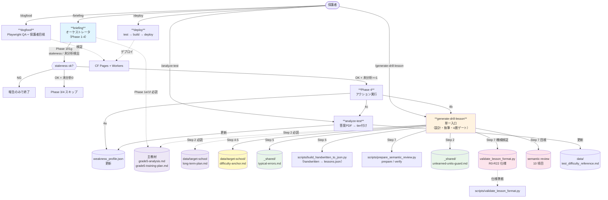
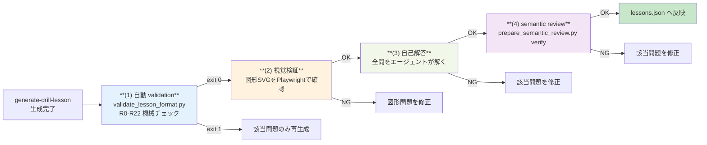
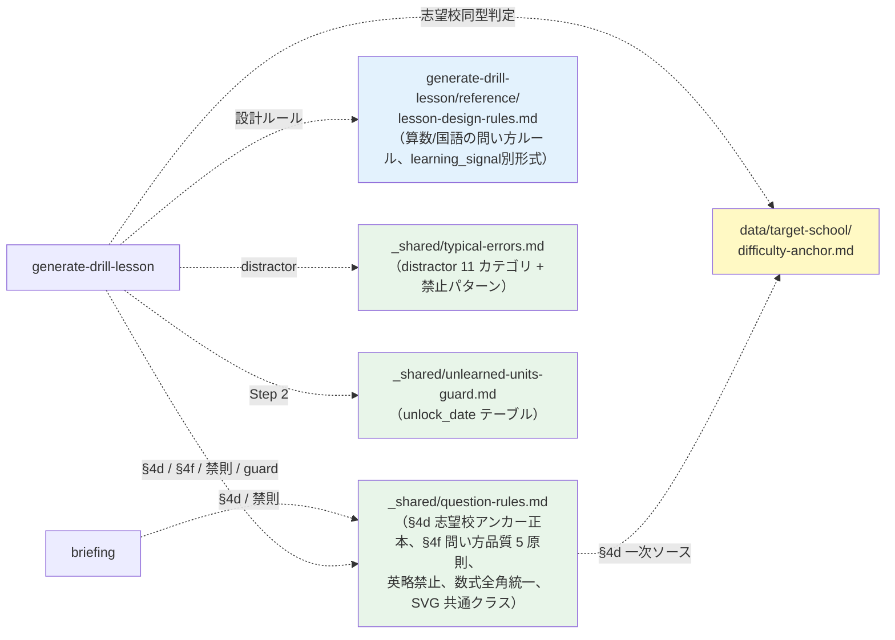

# Skill 呼び出しグラフ

**目的**: `.claude/skills/` の呼び出し関係・依存関係を可視化する。レッスン生成の単一入口は **`generate-drill-lesson`**。

新規レッスン生成では `.claude/skills/generate-drill-lesson/SKILL.md` と `reference/ownership-contract.md` を参照する。長期計画の正本は `data/textbooks/curriculum/grade5-training-plan.md`、構造分析は `data/textbooks/curriculum/grade5-analysis.md`、志望校ターゲット校方針は `data/target-school/long-term-plan.md`。

## 全体フロー

## 4 層ゲート（生成品質チェーン）

`generate-drill-lesson/reference/gates.md` が品質ゲートの正本。D1 は退役済みで、配信用 lesson は `frontend/public/data/lessons.json` に反映する。

## _shared/ 参照関係

## skill 一覧

| skill | 種別 | 行数 | 責務 |
|------|------|------|------|
| **briefing** | オーケストレータ | 267 | Phase 1-4。状況把握→再設計提案→generate-drill-lesson/analyze-test 呼び出し |
| **generate-drill-lesson** | 単一入口 | - | 弱点・テスト範囲・志望校アンカーに基づき、設計・執筆・JSON化・4層ゲートを実行 |
| **analyze-test** | atomic | 190 | 答案 PDF → tier 付け → weakness_profile / test_difficulty_reference 更新 |
| **fetch-school-kakomon** | atomic | - | 志望校の公式サイトが無料公開する過去問だけを検索・保護者確認・取得（第三者サイトは対象外） |
| **dogfood** | atomic | 81 | Playwright QA + 保護者目視 |
| **deploy** | atomic | 83 | test → build → deploy |
| **setup** | atomic | - | 初期セットアップ（Cloudflare 認証 → R2 → デプロイ → スモーク） |

## _shared/ 配下

| ファイル | 責務 | 参照元 |
|---------|------|--------|
| `data/textbooks/curriculum/grade5-analysis.md` | 5年ステージIII全体分析。単元連鎖・横断ボトルネック・志望校合格から逆算した重点 | briefing / generate-drill-lesson |
| `data/textbooks/curriculum/grade5-training-plan.md` | 5年ステージIII全体トレーニング計画。フェーズ計画・既習弱点スパイラル・科目別固定ルール・調整ルール | briefing / generate-drill-lesson |
| `data/target-school/long-term-plan.md` | 志望校入試形式・合格者平均・国算140〜150点ロードマップの根拠資料 | briefing / generate-drill-lesson |
| `question-rules.md` | §4d 志望校アンカー定義（正本）+ §4f 問い方品質 5 原則（出し惜しみ禁止）+ 禁則ルール全集 | briefing / generate-drill-lesson + reference 配下 |
| `typical-errors.md` | distractor カテゴリ 11 種 + 禁止パターン 3 種 | generate-drill-lesson Step 5 |
| `unlearned-units-guard.md` | 未学習単元の unlock_date テーブル | generate-drill-lesson Step 2 |

## generate-drill-lesson/reference/ 配下

| ファイル | 責務 | 参照元 |
|---------|------|--------|
| `ownership-contract.md` | ブロック別レッスンサイズ、必達難易度ミックス、設定責任 | generate-drill-lesson Step 1 |
| `lesson-design-rules.md` | 算数/国語の問い方、d4-d5プロセス問題、learning_signal別形式 | generate-drill-lesson Step 5 |
| `gates.md` | 機械検証、視覚検証、自己解答、semantic review | generate-drill-lesson Step 7 |

## 設計方針の補足

- 外部サイトの過去問・解説等を無断 WebFetch して出題内容に転用することはしない（著作権・利用規約上のリスクがあるため、`generate-drill-lesson/SKILL.md` に不採用の方針を明記）。
- レッスン生成は `generate-drill-lesson` に一本化されている。d2-d3 は自然文穴埋め `single_tier`、d4-d5算数は `two_tier` / `slot_two_tier`、d4-d5国語は `evidence_first` / `two_tier` を優先し、Step1で図・式・基準量・根拠・消去理由を問う。`scripts/validate_lesson_format.py` の R22 process_understanding は reject（d4-d5 でプロセス目的必須）。
